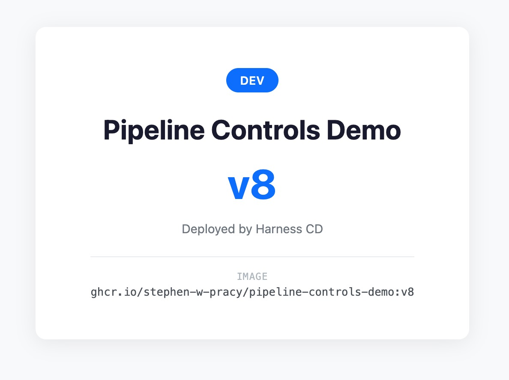
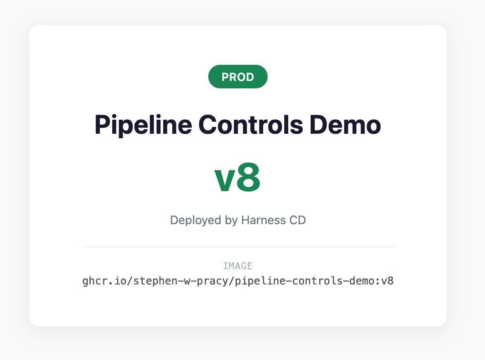
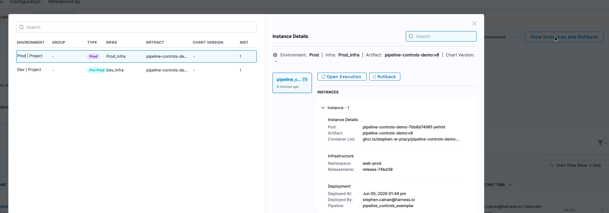
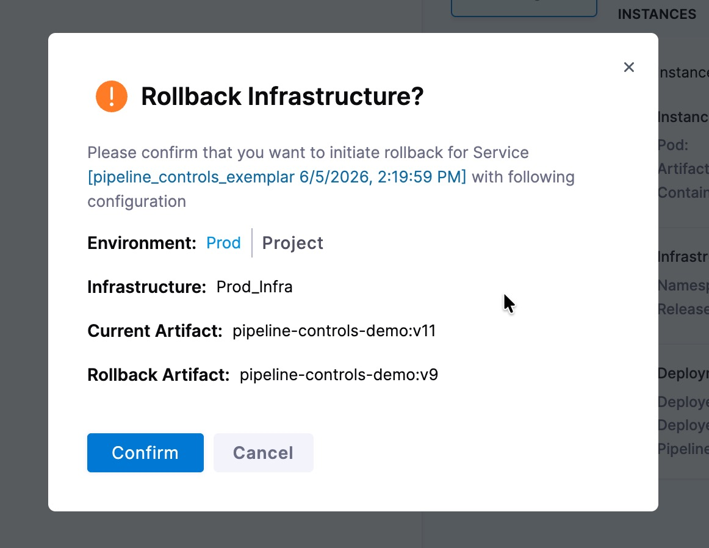
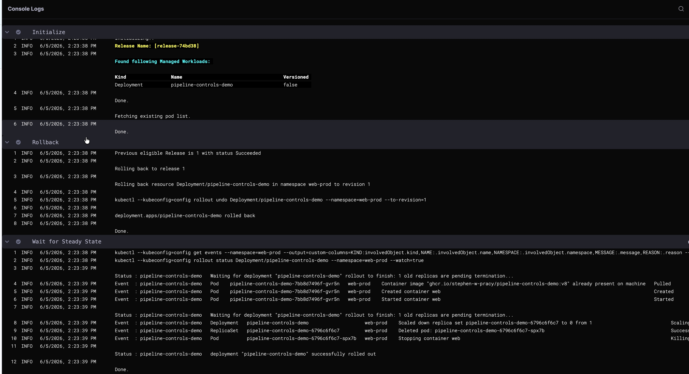
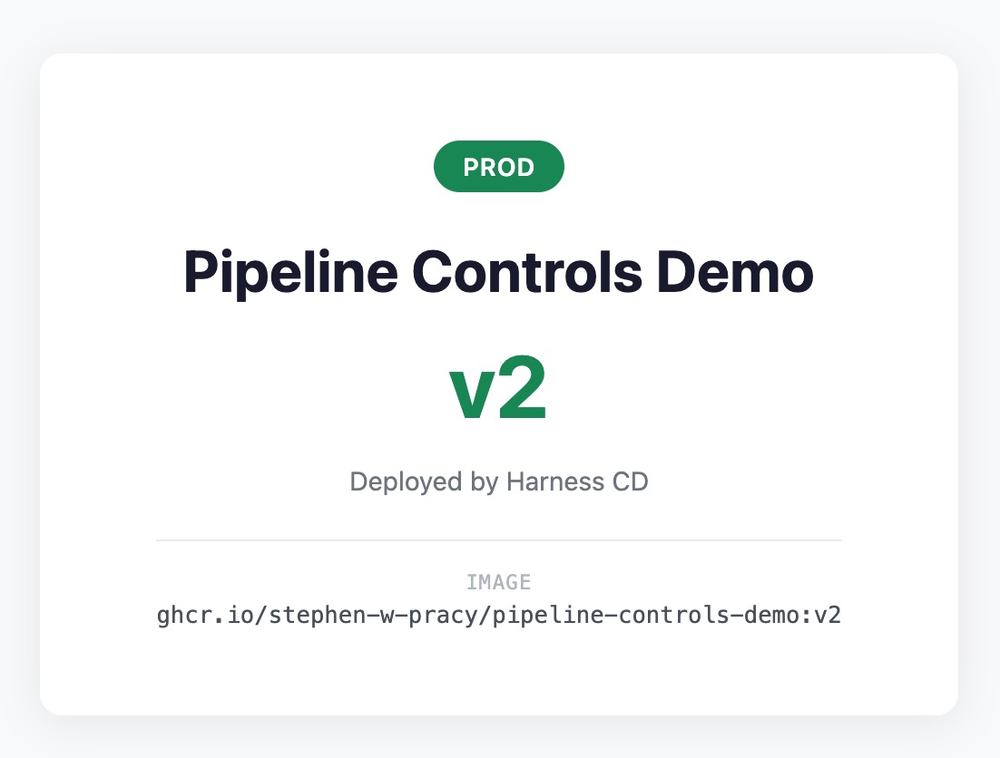

# CD Pipeline Controls — Build, Deploy, Rollback

This repository accompanies a Technical Tidbit video. It provides a reproducible
demo you can run in your own Harness account and Kubernetes cluster to practice
four Harness pipeline controls in a realistic build → deploy → recover workflow.

## What You Will Learn

By the end, you will be able to use four pipeline controls:

1. **Input Sets** — run a pipeline with an Input Set, and switch Input Sets to change what the run does (here: which environments are targeted).
2. **Execution-time variables** — use values resolved when the run executes rather than authored in advance: the build sequence id as the version/tag, and the image name and version read in the deploy stage from the artifact the build stage produced.
3. **Conditional execution** — use a stage condition so a stage runs only when a criterion is met (here: deploy to Prod only when the target list includes `prod`).
4. **Post-prod rollback** — trigger a post-production rollback and confirm the prior version is restored.

## Repository Structure

```
app/
  server.py                    # Python HTTP server (serves HTML from ConfigMap)
  Dockerfile                   # Container image definition
k8s/
  deployment.yaml              # Kubernetes Deployment (with imagePullSecrets)
  service.yaml                 # ClusterIP Service
  configmap.yaml               # HTML page template (Go templating)
  Dev.yaml                     # Values file for the Dev environment
  Prod.yaml                    # Values file for the Prod environment
.harness/
  pipeline.yaml                # CI/CD pipeline (Build → Dev → Prod)
  service.yaml                 # Harness Service entity
  environment-dev.yaml         # Dev environment definition
  environment-prod.yaml        # Prod environment definition
  infra-dev.yaml               # Dev infrastructure definition
  infra-prod.yaml              # Prod infrastructure definition
  connector-github.yaml        # GitHub code connector
  connector-ghcr.yaml          # GHCR Docker registry connector
  connector-k8s.yaml           # K8s cluster connector
  ghcr-token-secret.yaml       # Secret reference for GitHub PAT
  inputsets/
    dev-only.yaml              # Deploys to Dev only
    full-release.yaml          # Deploys to Dev and Prod
scripts/
  setup.sh                     # Automated provisioning (Harness + cluster + delegate)
  cleanup.sh                   # Tears everything down (Harness project + cluster + GHCR package)
  port-forward.sh              # Foreground port-forward to Dev (8080) and Prod (8081)
  validate-setup.sh            # Pre-flight environment checks
docs/
  colima-zscaler-tls-fix.md    # TLS fix for corporate proxy environments
  resource-map.md              # Identifier graph + templating-layer ownership
  placeholders.md              # ${VAR} → .env → consuming-files table
  parity-matrix.md             # README ↔ scripts ↔ specs cross-reference
```

## Prerequisites

- A Kubernetes cluster accessible from the internet (for Harness Delegate)
- `kubectl` configured to access your cluster
- A Harness account (free tier works) — [sign up](https://app.harness.io/auth/#/signup)
- A GitHub account (for forking this repo and as a container registry via GHCR)
- A GitHub Personal Access Token (classic) with these scopes: `repo`, `write:packages`, `delete:packages`
- Permissions to run pipelines and trigger rollbacks in Harness
- Either permission to **create a Harness project**, or an existing org + project you can write resources into

## Automated Setup (Optional)

If you'd rather not click through the manual steps below, `scripts/setup.sh`
provisions everything for you: the Harness project (optional), secret,
connectors, service, environments, infrastructures, pipeline, and input sets —
plus your cluster namespaces, the GHCR image pull secret, and a Harness Delegate
via Helm.

```bash
cp .env.example .env     # fill in your account ID, API key, GitHub details
./scripts/setup.sh --dry-run   # preview every API call and command (changes nothing)
./scripts/setup.sh             # provision for real
```

Use `--dry-run` first to review exactly what will be created — it prints each
API request, rendered YAML body, and cluster/Helm command, with secrets
redacted, without touching your account or cluster.

The script reads `.env` (gitignored), renders the templated YAML in `.harness/`,
and creates each resource via the Harness API. It's re-runnable — existing
resources are updated rather than duplicated. Set `CREATE_PROJECT=false` in
`.env` to target an existing org/project instead of creating one.

Requirements: `curl`, `kubectl`, `helm`, `jq`, `yq`, and `envsubst` (part of `gettext`).

> **Prefer to understand each piece?** The manual steps below create the same
> resources one at a time. They're also the fallback if the script hits a
> permission or environment issue.

## Setup

### 1. Fork and Clone This Repository

Fork this repository to your GitHub account, then clone it locally:

```bash
git clone https://github.com/<your-username>/cd-tidbit-pipeline-control-rollback.git
cd cd-tidbit-pipeline-control-rollback
```

### 2. Install the Harness Delegate

The Delegate is an agent that runs in your cluster and executes pipeline tasks.

```bash
helm repo add harness-delegate https://app.harness.io/storage/harness-download/delegate-helm-chart/
helm repo update

helm install harness-delegate harness-delegate/harness-delegate-ng \
  --namespace harness-delegate --create-namespace \
  --set delegateName=pipeline-controls-delegate \
  --set accountId=<YOUR_ACCOUNT_ID> \
  --set delegateToken=<YOUR_DELEGATE_TOKEN> \
  --set managerEndpoint=https://app.harness.io
```

Find your Account ID and Delegate Token in **Harness → Account Settings → Account Resources → Delegates → New Delegate**.

See [Install Delegate](https://developer.harness.io/docs/platform/delegates/install-delegates/overview/) for full options.

### 3. Create a Kubernetes Connector

In your Harness project:

1. Go to **Connectors → New Connector → Kubernetes Cluster**
2. Name: `pipeline-demo-cluster`
3. Connection method: **Use a Harness Delegate** → select the delegate you just installed
4. Test the connection and save

### 4. Create a GitHub Connector

Harness needs access to your fork for both code (pipeline, manifests) and the container registry (GHCR).

1. Go to **Connectors → New Connector → GitHub**
2. Configure:
   - Name: `pipeline-demo-github`
   - URL Type: **Repository**
   - Connection Type: **HTTP**
   - GitHub Repository URL: `https://github.com/<your-username>/cd-tidbit-pipeline-control-rollback`
   - Authentication: **Username and Token** — use your GitHub username and a Harness Secret containing your PAT
   - Enable API Access: **Token** — select the same secret
3. Connectivity Mode: **Connect through Harness Platform**
4. Test and save

### 5. Create a GHCR Connector

This connector allows the Build stage to push images to GitHub Container Registry.

1. Go to **Connectors → New Connector → Docker Registry**
2. Configure:
   - Name: `pipeline-demo-ghcr`
   - Provider Type: **Other**
   - Docker Registry URL: `https://ghcr.io/<your-username>`
   - Authentication: **Username and Password** — use your GitHub username and the same PAT secret
3. Connectivity Mode: **Connect through Harness Platform**
4. Test and save

### 6. Create Kubernetes Namespaces

```bash
kubectl create namespace web-dev
kubectl create namespace web-prod
```

### 7. Create Image Pull Secrets

GHCR packages are private by default. Your cluster needs credentials to pull images.

```bash
kubectl create secret docker-registry ghcr-cred \
  --docker-server=ghcr.io \
  --docker-username=<your-github-username> \
  --docker-password=<your-github-pat> \
  -n web-dev

kubectl create secret docker-registry ghcr-cred \
  --docker-server=ghcr.io \
  --docker-username=<your-github-username> \
  --docker-password=<your-github-pat> \
  -n web-prod
```

> **Note:** If you make your GHCR package public (in GitHub → Packages → package settings → Danger Zone → Change visibility), you can skip this step. The deployment manifest still references the secret, but Kubernetes will proceed if the secret doesn't exist and the registry allows anonymous pulls.

### 8. Create Environments and Infrastructure in Harness

Create two Environments in your Harness project:

1. Go to **Environments → New Environment**
2. Create:
   - **Dev** — type: Pre-Production
   - **Prod** — type: Production

> **Environment names matter.** The Service selects its values file by
> environment name (`k8s/<+env.name>.yaml`), so the environments must be named
> exactly **Dev** and **Prod** to match `k8s/Dev.yaml` and `k8s/Prod.yaml`.

For each Environment, create an Infrastructure Definition:
- Name: `Dev_Infra` / `Prod_Infra`
- Infrastructure Type: **Kubernetes**
- Connector: select `pipeline-demo-cluster`
- Namespace: `web-dev` for Dev, `web-prod` for Prod
- **Release Name**: leave at the default `release-<+INFRA_KEY_SHORT_ID>`. This gives each environment a unique, stable release name that Harness uses to track versions and roll back correctly.

### 9. Create a Service in Harness

1. Go to **Services → New Service**
2. Name: `pipeline-controls-demo`
3. Deployment Type: **Kubernetes**
4. Add the manifest:
   - Type: **K8s Manifest** → Store: **GitHub**
   - Connector: `pipeline-demo-github`
   - Manifest Identifier: `pipeline_controls`
   - Branch: `main`
   - File/Folder Path: `k8s/deployment.yaml`, `k8s/service.yaml`, `k8s/configmap.yaml`
   - Values YAML Path: `k8s/<+env.name>.yaml` (set the field type to Expression `f(x)`)
5. Add primary artifact:
   - Type: **GitHub Package Registry**
   - Connector: `pipeline-demo-github`
   - Package Name: `pipeline-controls-demo`
   - Package Type: **container**
   - Version: set to Runtime Input (`<+input>`)

The ConfigMap is part of the Service manifests (not applied as a separate step),
so Harness versions it alongside the Deployment. A rolling deploy or rollback
carries both forward and back together.

> **Note on placeholders.** The YAML files in `.harness/` contain `${...}`
> placeholders (e.g. `${HARNESS_ORG}`, `${GITHUB_USERNAME}`) used by the
> automated setup script. If you paste these files manually, replace each
> placeholder with your own value first. Harness expressions like `<+env.name>`
> are **not** placeholders — leave them as-is.

### 10. Create the Pipeline

1. In your project, go to **Pipelines → Create a Pipeline**
2. Switch to the **YAML** editor and paste the contents of `.harness/pipeline.yaml` (substituting the `${...}` placeholders)
3. Confirm the `connectorRef` and `repo` values in the Build step match your connector and GHCR image path
4. Save

### 11. Create Input Sets

1. Go to your pipeline → **Input Sets → New Input Set**
2. Switch to the **YAML** editor and paste the contents of `.harness/inputsets/dev-only.yaml` (substituting the `${...}` placeholders)
3. Save, then repeat for `.harness/inputsets/full-release.yaml`

---

## How the Pipeline Works

```
┌─────────┐     ┌──────────────┐     ┌───────────────┐
│  Build  │────▶│ Deploy to Dev│────▶│ Deploy to Prod│
│         │     │              │     │ (conditional) │
└─────────┘     └──────────────┘     └───────────────┘
```

- **Build**: Builds the container image from `app/Dockerfile` and pushes to GHCR, tagged with `v<+pipeline.sequenceId>`
- **Deploy to Dev**: Rolls out the Deployment, Service, and versioned ConfigMap to the `web-dev` namespace
- **Deploy to Prod**: Runs only if `target_envs` includes `prod` (conditional execution). Same rolling deploy to `web-prod`

The same container image is deployed to both environments. The HTML page content
comes from a ConfigMap rendered with Go templating. The values differ per
environment via `k8s/Dev.yaml` and `k8s/Prod.yaml` (selected by `<+env.name>`):
Dev shows a blue badge, Prod shows green.

**The four controls in action:**

| Control | Where | What it does |
|---------|-------|--------------|
| Input Sets | `target_envs` variable | Dev Only sets `dev` (Prod skipped); Full Release sets `dev,prod` (Prod runs) |
| Execution-time variables | `v<+pipeline.sequenceId>`, `<+artifact.version>`, `<+artifact.image>` | Version auto-increments; artifact details flow into the page at deploy time |
| Conditional execution | Prod stage `when` condition | `target_envs.contains("prod")` gates the Prod deploy |
| Post-prod rollback | Service → View Instances and Rollback | Reverts Prod to the prior release (image + ConfigMap) |

**Version label.** The version shown on the page and used as the image tag is
derived from the pipeline's execution sequence id (`v<+pipeline.sequenceId>`).
It increments by one on every run — there is nothing to type. Your first run in
a fresh project will be `v1`, but if you've run the pipeline during setup you'll
see higher numbers. That's expected.

---

## Run the Demo

The golden path below exercises all four controls. Each pipeline run advances the
version by one. We use **v1**, **v2**, **v3** as examples — substitute your actual
numbers.

### Step 1 — Dev Only: deploy v1, skip Prod

1. Go to your pipeline and click **Run**
2. Select the **Dev Only** Input Set
3. Notice `target_envs` is set to `dev`
4. Click **Run Pipeline**

**What happens:**
- Build pushes `pipeline-controls-demo:v1`
- Deploy to Dev succeeds
- Deploy to Prod is **skipped** (conditional execution: `"dev".contains("prod")` is false)

Verify Dev is live using the utility script:
```bash
make port-forward-dev
# Or, if you prefer to forward manually:
# kubectl port-forward svc/pipeline-controls-demo 8080:80 -n web-dev
```

> [!NOTE]
>
> `make port-forward-dev` runs in the foreground and reconnects the service
> automatically each time the pipeline rolls out a new pod in the `web-dev`
> namespace (or a rollback rotates them back). Ctrl-C stops forwards cleanly.
>
> `make port-forward-prod` does the same for the production service in `web-prod`.
> `make port-forward` forwards both services simultaneously.


Visit [http://localhost:8080](http://localhost:8080) in your browser. You
should see the page with a blue badge and the version number `v1`:



### Step 2 — Full Release: deploy v2 to Dev and Prod

1. Run the pipeline again with the **Full Release** Input Set
2. Notice `target_envs` is now `dev,prod`

**What happens:**
- Build pushes `pipeline-controls-demo:v2`
- Deploy to Dev succeeds
- Deploy to Prod **runs** (conditional execution: `"dev,prod".contains("prod")` is true)

Verify Dev and Prod are now at `v2`:

```bash
make port-forward
# Or, if you prefer to forward manually:
# kubectl port-forward svc/pipeline-controls-demo 8080:80 -n web-dev
# kubectl port-forward svc/pipeline-controls-demo 8081:80 -n web-prod
```

Visit [http://localhost:8080](http://localhost:8080) in your browser. You
should see the page with a blue badge and the version number `v2`:


Visit [http://localhost:8081](http://localhost:8081) in your browser. You
should see the page with a green badge and the version number `v2`:



The version and image on the page are execution-time variables — the sequence id
computed at run start, and the artifact details resolved during deployment.

### Step 3 — Full Release again: deploy v3

Run **Full Release** one more time. This creates a second successful Prod
deployment, which is required for rollback (Harness needs a prior release to
revert to).

Visit [http://localhost:8081](http://localhost:8081) in your browser. You
should see the page with a green badge and the version number `v3`:

### Step 4 — Post-prod rollback: restore v2

1. In the Harness global navigation, go to **Deployments → Services**
2. Click **pipeline-controls-demo**
3. Click **View Instances and Rollback**



4. On the **Prod** row, click **Rollback**
5. The confirmation dialog shows the current artifact and the rollback target:



6. Click **Confirm**

A rollback execution runs. It reverts the Deployment and ConfigMap to the
previous release:



### Step 5 — Confirm v2 is restored

Visit [http://localhost:8081](http://localhost:8081) in your browser. You
should see that Prod has returned to `v2`:



### Step 6 — Confirm Dev is unaffected

Visit [http://localhost:8080](http://localhost:8081) in your browser. You
should see that Dev has remains at `v3`:


---

## Good to Know: What a Post-Prod Rollback Actually Is

A post-prod rollback is **not** a re-run of the pipeline with rollback steps
switched on. It is a *separate execution* that replays the original run's
already-resolved YAML and runs only the rollback steps.

| Control | Normal run | Post-prod rollback |
|---------|-----------|--------------------|
| Input Sets | Merged into the YAML at run start | Not re-applied; the original resolved YAML is replayed |
| Conditional execution | Evaluated as the run proceeds | Not re-evaluated; the original resolved outcome is replayed |
| Execution mode | `<+pipeline.executionMode>` = `NORMAL` | `<+pipeline.executionMode>` = `POST_EXECUTION_ROLLBACK` |

Rollback requires at least **two successful deployments** to the same
environment. If only one release exists, there is nothing to revert to.

---

## Cleanup

When you're done with the tutorial, `scripts/cleanup.sh` undoes everything
`setup.sh` created:

```bash
./scripts/cleanup.sh --dry-run   # preview every DELETE; change nothing
./scripts/cleanup.sh             # interactive — type 'yes' to confirm
./scripts/cleanup.sh -y          # skip the prompt
```

It deletes the Harness project (cascading to all child resources), the
`web-dev` and `web-prod` cluster namespaces, the Harness Delegate (helm
uninstall + namespace delete), and the GHCR package. Re-runnable: missing
items are skipped, not errored.

> **GHCR package delete needs the `delete:packages` scope.** If your PAT only
> has `write:packages`, you'll see a 403 — add the scope, or delete the
> package manually in GitHub → Packages.

---

## Troubleshooting

**Build stage fails with registry auth errors**
Verify your GHCR connector credentials. The PAT needs `write:packages` scope.
Ensure the connector URL includes your username: `https://ghcr.io/<your-username>`.

**Prod stage never runs**
Expected with the **Dev Only** Input Set. To deploy Prod, use **Full Release**
(or set `target_envs` to include `prod` at run time).

**Badge color is the same in both environments**
Check that your environments are named exactly **Dev** and **Prod** and that the
Service's Values YAML path is `k8s/<+env.name>.yaml`.

**ImagePullBackOff / 401 Unauthorized**
Your GHCR package is private (the default). Create the `ghcr-cred` secret in the
target namespace (see Step 7 above), or make the package public in GitHub.

**x509: certificate signed by unknown authority**
Your cluster can't verify the registry's TLS certificate. This commonly happens
with corporate TLS inspection proxies (Zscaler, Netskope). See
[docs/colima-zscaler-tls-fix.md](docs/colima-zscaler-tls-fix.md) for a Colima-specific fix.

**Rollback says "No previous eligible release found"**
Harness needs at least two successful deployments to the environment before
rollback is available. Run Full Release twice, then try rollback on the second
deployment.

**Pipeline import fails**
Ensure your Git connector can reach your fork. The PAT needs `repo` scope for
private repos (or the repo must be public).

---
**Helpful commands for inspecting the cluster**

```bash
# Check deployment status
kubectl get deploy,po -n web-dev
kubectl get deploy,po -n web-prod

# Check which image is running
kubectl get po -o jsonpath='{range .items[*]}{.metadata.name}: {.spec.containers[0].image}{"\n"}{end}' -n web-prod

# Port-forward to view the page (recommended — auto-reconnects when pods rotate)
make port-forward          # Dev → http://127.0.0.1:8080  Prod → http://127.0.0.1:8081

# Or one environment at a time:
kubectl port-forward svc/pipeline-controls-demo 8080:80 -n web-dev
kubectl port-forward svc/pipeline-controls-demo 8081:80 -n web-prod
```

